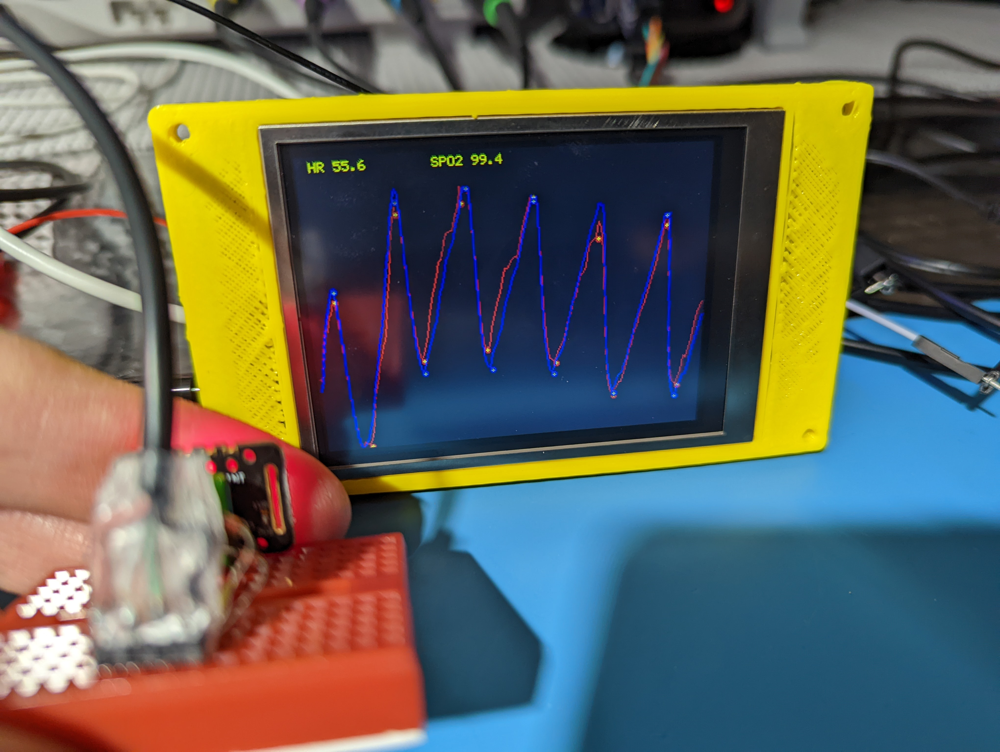

# Toy MAX30102 cardiac monitor

## MCU/Display

Re-purposed and slightly modified Makerbase MKS TFT32_L V3.0 display board from an old 3d printer.

### MKS board

USB port is [hacked](./doc/MKS-TFT32_L-V3.0_004-SCH-MOD.svg) to connect MAX30102 module (I2C).

## Example output

## Links

* [Rust RTIC](https://rtic.rs/dev/book/en/)

* [MKS Hardware](https://github.com/makerbase-mks/MKS-TFT-Hardware/tree/master/MKS%20TFT32/MKS%20TFT32_L%20V3.x)
* [LCD ILI9328](https://cdn-shop.adafruit.com/datasheets/ILI9328.pdf)

* [MAX30102 module](https://mhetlive.nodebb.com/topic/44/mh-et-live-max30102-pulse-oximeter-and-heart-rate-sensor)
* [MAX30102 arduino lib](https://github.com/MHEtLive/MH-ET-LIVE-max30102/tree/master/Arduino%20code/MH_MAX3010x_Sensor_Library-master)
* [MAX30102 datasheet](https://datasheets.maximintegrated.com/en/ds/MAX30102.pdf)
* [MAX30102 Rust driver](https://github.com/eldruin/max3010x-rs)
* [MAX30102 instructable](https://www.instructables.com/Pulse-Oximeter-With-Much-Improved-Precision/)
